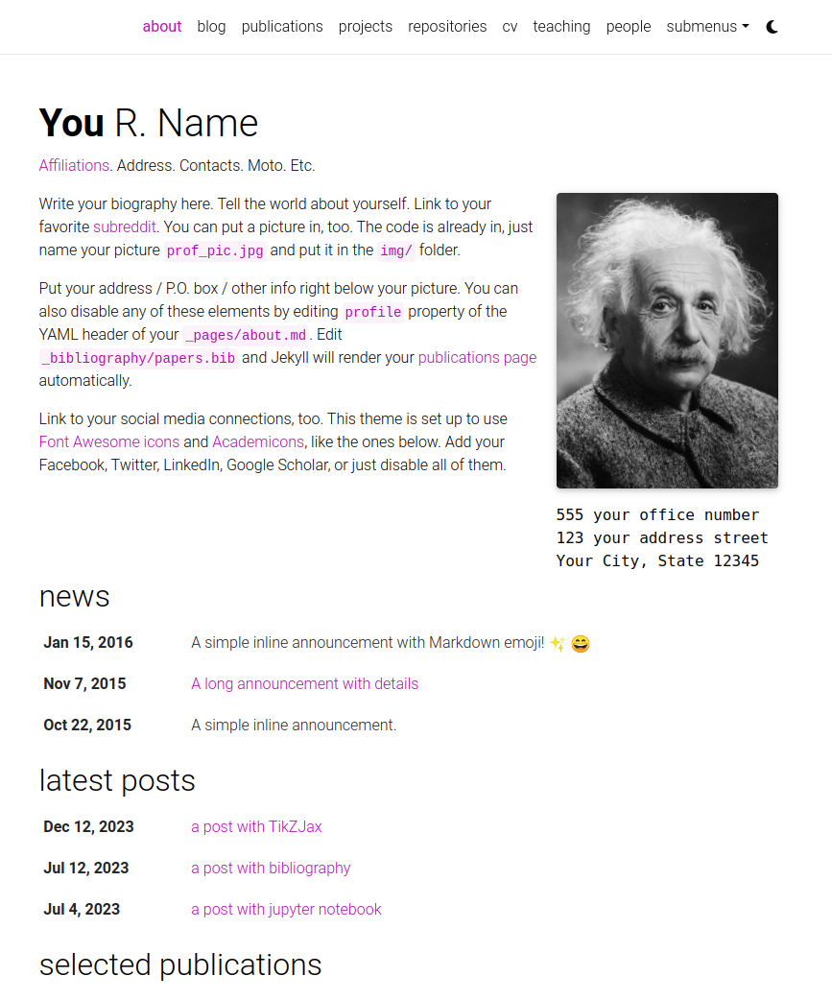
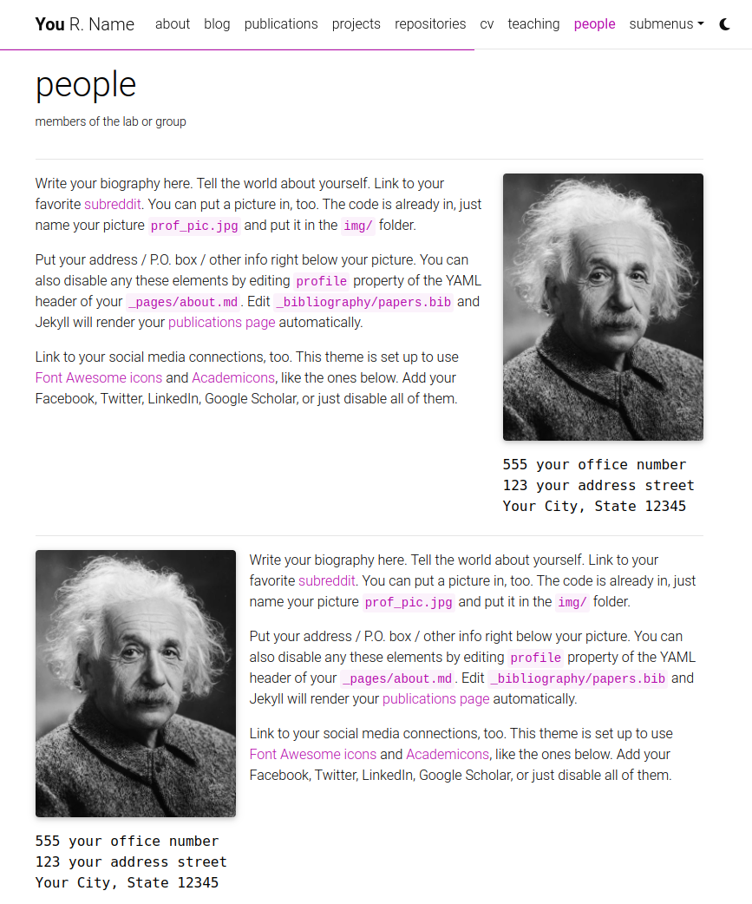
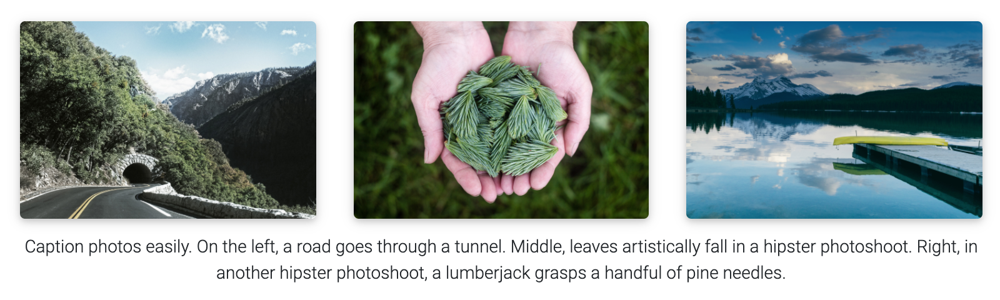

# Zhaomin Wu Website

## Content CMS and CV Generation

This public repository uses Decap CMS, a Cloudflare Worker, and GitHub Actions to manage content. The CMS edits only semantic source files; the website, Publications page, and downloadable PDF are generated from the same data. The `CV` navigation item opens the PDF directly. The original `/cv/` HTML page is retained but has no public navigation link and is excluded from the sitemap. Existing content has been migrated to these files, so the first build does not clear it.

### CMS Content Model

Sign in to the [site CMS](https://www.zhaominwu.com/admin/) with the permitted GitHub account. Each Publish operation commits directly to `main`; GitHub Actions validates the data, generates derived artifacts, compiles the PDF, and deploys the site.

| CMS area | Editable content | Source file |
| --- | --- | --- |
| `News` | Markdown news items | `_news/*.md` |
| `Website Profile` | Name, website biography, avatar, social links, and shared identity information | `_data/content/profile.yml` |
| `Publications` | One complete `.bib` record per publication | `_data/content/publications/*.bib` |
| `Service` | Conference Reviewers, Journal Reviewers, Recognition, and Tutorial Speaker; each is edited independently | `_data/content/service/*.yml` |
| `Teaching & Mentoring` | One entry containing separate Teaching and Mentoring editors for courses and student lists | `_data/content/teaching.yml`, `_data/content/mentoring.yml` |
| `Talks` | Invited talks, keynotes, tutorials, and seminars | `_data/content/talks.yml` |
| `Site Settings` | SEO, footer text, and publication venue badges | `_data/content/site.yml` |
| `CV` | CV Profile, main jobs and subjobs, education, awards, skills, languages, volunteer work, Publication Display, Research Impact, and custom CV sections; each is an independent second-level entry | `_data/content/cv/*.yml` |

Each `Publication` must contain exactly one complete BibTeX record. Its citation key and filename must match exactly and use lowercase `firstauthorYYYYshorttitle` form, for example `@inproceedings{wu2026llmdna, ...}` in `wu2026llmdna.bib`; underscores, hyphens, DOIs, DBLP identifiers, and numeric-only keys are not allowed. The CMS and build validate this convention. `selected = {true}` controls only the Selected Publications section on the home page. `cv_selected = {true}` controls only Selected Publications in the HTML CV and PDF, while `cv_order` controls its order. The build automatically separates records into `Publications` and `Preprints` from their arXiv venue. Preprints remain on the website Publications page but are intentionally omitted from the HTML and PDF CVs.

For ACL-family Findings papers, keep the official proceedings title in `booktitle` and the concise conference-year label in `abbr` (for example, `ACL 2025`). The website and CV automatically render the final venue as `ACL 2025 Findings` without repeating the year, while the leading venue badge remains `ACL 2025`.

`Teaching & Mentoring` is one CMS entry with independent `Teaching` and `Mentoring` items. Teaching supports Teaching Assistant, Instructor, Guest Lecture, and other teaching experience; Mentoring maintains student lists, links, notes, destinations, and CV summary groups. Both generate their corresponding website and CV sections. `Work Experience` uses main jobs and subjobs: roles at the same institution belong under one main job, while a different institution requires a new main job. `CV Profile` belongs to the `CV` collection; shared identity data such as name, email, and avatar lives only in `Website Profile` to avoid duplication.

### Local CMS

By default, `http://localhost:8080/admin/` cannot read unpushed local files because the GitHub backend reads remote `main`. The project enables Decap's local backend. In another WSL terminal at the repository root, run the following command so the local CMS reads from and writes to the current working tree without pushing:

```sh
BIND_HOST=localhost npx decap-server
```

Keep that process running, then force-refresh `http://localhost:8080/admin/`. The local proxy uses `http://localhost:8081/api/v1` only for development; the production CMS continues to use Cloudflare OAuth and GitHub `main`.

The Docker preview automatically regenerates website data after a local CMS save. To also rebuild the local PDF automatically, start the watcher once in a third WSL terminal:

```sh
PYTHON=python3 ./build_cv_pdf.sh watch
```

The watcher rebuilds the website data and PDF whenever `_data/content/` or a publication `.bib` file changes. It modifies only the current working tree and never commits or pushes. Production CMS publishes run this entire validation, generation, compilation, and deployment flow automatically in GitHub Actions.

### Generated Artifacts

| Generated output | Purpose |
| --- | --- |
| `_data/generated/content.yml` | Jekyll view model for About, Service, Teaching, Talks, and CV |
| `_bibliography/papers.bib`, `_bibliography/publications.bib`, `_bibliography/preprints.bib` | Automatically generated bibliographies for Jekyll Scholar |
| `assets/json/resume.json` | JSON Resume data for the retained HTML CV page |
| `assets/latex/generated/*.tex` | Generated LaTeX fragments for the PDF CV |
| `assets/pdf/ZhaominWu.pdf` | Public downloadable PDF |

Do not edit these derived artifacts manually. For a one-off local validation and build, run:

```sh
python3 -m pip install -r requirements.txt
python3 scripts/build_cv_content.py validate
python3 scripts/build_cv_content.py build
make -C assets/latex
```

`./build_cv_pdf.sh watch` watches YAML, BibTeX, and LaTeX files and recompiles continuously. On Windows, use `build_cv_pdf.bat`.

### Cloudflare OAuth Configuration

The Cloudflare Worker performs the GitHub OAuth exchange. The static site, repository, and GitHub Actions do not store the OAuth client secret. See [cloudflare/README.md](cloudflare/README.md) for the complete deployment guide.

The production Worker URL is `https://zhaominwu-cms-auth.jerrylifewzm.workers.dev`. The GitHub OAuth App callback URL must be exactly:

```text
https://zhaominwu-cms-auth.jerrylifewzm.workers.dev/callback
```

Before a routine deployment of an existing Worker, confirm only the secret names and explicitly retain Dashboard bindings:

```sh
cd cloudflare
npx wrangler secret list
npx wrangler deploy --keep-vars
```

The expected secret names are `GITHUB_CLIENT_SECRET` and `OAUTH_STATE_SECRET`. `GITHUB_CLIENT_ID` is a non-secret Cloudflare Dashboard Worker Variable. Do not place the values of any of these three bindings in the repository or in chat.

When creating the Worker for the first time, create local configuration from the template, set the `GITHUB_CLIENT_ID` variable in the Dashboard, and use `wrangler secret put` for the two secrets:

```sh
cd cloudflare
cp wrangler.toml.example wrangler.toml
npx wrangler secret put GITHUB_CLIENT_SECRET
npx wrangler secret put OAUTH_STATE_SECRET
npx wrangler deploy --keep-vars
```

The non-secret production values in `wrangler.toml` should be:

```toml
CMS_REPOSITORY = "JerryLife/JerryLife.github.io"
CMS_BRANCH = "main"
CMS_ALLOWED_ORIGINS = "https://www.zhaominwu.com,https://zhaominwu.com"
```

`OAUTH_STATE_SECRET` must contain at least 32 random characters. Do not put either secret in Git, `admin/config.yml`, or GitHub Actions Secrets. Actions Secrets are unavailable to the browser login flow and cannot replace a Worker Secret. After deployment, use the following command to confirm that the Worker source is live:

```sh
curl --fail https://zhaominwu-cms-auth.jerrylifewzm.workers.dev/health
```

The expected response is `Decap CMS OAuth proxy is running.`. The Worker restricts allowed site origins, the GitHub login, repository write permission, and the `main` branch.

## Upstream Theme

This site is based on al-folio.

<div align="center">

[](https://alshedivat.github.io/al-folio/)

**A simple, clean, and responsive [Jekyll](https://jekyllrb.com/) theme for academics.**

---

[](https://github.com/alshedivat/al-folio/actions/workflows/deploy.yml)
[](#maintainers)
[](https://github.com/alshedivat/al-folio/graphs/contributors/)
[](https://hub.docker.com/r/amirpourmand/al-folio)
[](https://hub.docker.com/r/amirpourmand/al-folio)
[](https://hub.docker.com/r/amirpourmand/al-folio)

[](https://github.com/alshedivat/al-folio/releases/latest)
[](https://github.com/alshedivat/al-folio/blob/main/LICENSE)
[](https://github.com/alshedivat/al-folio)
[](https://github.com/alshedivat/al-folio/fork)

</div>

## User community

The vibrant community of **al-folio** users is growing!
Academics around the world use this theme for their homepages, blogs, lab pages, as well as webpages for courses, workshops, conferences, meetups, and more.
Check out the community webpages below.
Feel free to add your own page(s) by sending a PR.

<table>
<tr>
<td>Academics</td>
<td>
<a href="https://martinbulla.github.io" target="_blank">★</a>
<a href="https://maruan.alshedivat.com" target="_blank">★</a>
<a href="https://www.cs.columbia.edu/~chen1ru/" target="_blank">★</a>
<a href="https://maithraraghu.com" target="_blank">★</a>
<a href="https://platanios.org" target="_blank">★</a>
<a href="https://otiliastr.github.io" target="_blank">★</a>
<a href="https://www.maths.dur.ac.uk/~sxwc62/" target="_blank">★</a>
<a href="https://jessachandler.com/" target="_blank">★</a>
<a href="https://mayankm96.github.io/" target="_blank">★</a>
<a href="https://markdean.info/" target="_blank">★</a>
<a href="https://kakodkar.github.io/" target="_blank">★</a>
<a href="https://sahirbhatnagar.com/" target="_blank">★</a>
<a href="https://spd.gr/" target="_blank">★</a>
<a href="https://jay-sarkar.github.io/" target="_blank">★</a>
<a href="https://aborowska.github.io/" target="_blank">★</a>
<a href="https://aditisgh.github.io/" target="_blank">★</a>
<a href="https://alexhaydock.co.uk/" target="_blank">★</a>
<a href="https://alixkeener.net/" target="_blank">★</a>
<a href="https://andreea7b.github.io/" target="_blank">★</a>
<a href="https://rishabhjoshi.github.io/" target="_blank">★</a>
<a href="https://sheelabhadra.github.io/" target="_blank">★</a>
<a href="https://giograno.me/" target="_blank">★</a>
<a href="https://immsrini.github.io/" target="_blank">★</a>
<a href="https://apooladian.github.io/" target="_blank">★</a>
<a href="https://chinmoy-dutta.github.io/" target="_blank">★</a>
<a href="https://liamcli.com/" target="_blank">★</a>
<a href="https://yoonholee.com/" target="_blank">★</a>
<a href="https://zrqiao.github.io/" target="_blank">★</a>
<a href="https://abstractgeek.github.io/" target="_blank">★</a>
<a href="https://www.compphys.de/" target="_blank">★</a>
<a href="https://julianstreyczek.github.io" target="_blank">★</a>
<a href="https://sdaza.com" target="_blank">★</a>
<a href="https://niweera.gq" target="_blank">★</a>
<a href="https://www.alihkw.com" target="_blank">★</a>
<a href="https://amirpourmand.ir" target="_blank">★</a>
<a href="https://scottleechua.github.io" target="_blank">★</a>
<a href="https://sk1y101.github.io" target="_blank">★</a>
<a href="https://yyang768osu.github.io" target="_blank">★</a>
<a href="https://veedata.github.io" target="_blank">★</a>
<a href="https://K-Wu.github.io" target="_blank">★</a>
<a href="https://amalawilson.com" target="_blank">★</a>
<a href="https://tirtharajdash.github.io" target="_blank">★</a>
<a href="https://carolinacarreira.github.io" target="_blank">★</a>
<a href="https://manandey.github.io" target="_blank">★</a>
<a href="https://johanneshoerner.github.io" target="_blank">★</a>
<a href="https://ioannismavromatis.com" target="_blank">★</a>
<a href="https://taidnguyen.github.io" target="_blank">★</a>
<a href="https://lbugnon.github.io" target="_blank">★</a>
<a href="https://joahannes.github.io" target="_blank">★</a>
<a href="https://dominikstrb.github.io" target="_blank">★</a>
<a href="https://tylerbarna.com" target="_blank">★</a>
<a href="https://daviddmc.github.io/" target="_blank">★</a>
<a href="https://andreaskuster.ch/" target="_blank">★</a>
<a href="https://ellisbrown.github.io/" target="_blank">★</a>
<a href="https://djherron.github.io/" target="_blank">★</a>
<a href="https://rodosingh.github.io/" target="_blank">★</a>
<a href="https://vdivakar.github.io/" target="_blank">★</a>
<a href="https://george-gca.github.io/" target="_blank">★</a>
<a href="https://bashirkazimi.github.io/" target="_blank">★</a>
<a href="https://dohaison.github.io/" target="_blank">★</a>
<a href="https://raphaaal.github.io/" target="_blank">★</a>
<a href="https://varuniyer.info/" target="_blank">★</a>
<a href="https://yukimasano.github.io/" target="_blank">★</a>
<a href="https://hashe037.github.io/" target="_blank">★</a>
<a href="https://wang-boyu.github.io/" target="_blank">★</a>
<a href="https://qingqingchen.info" target="_blank">★</a>
<a href="https://bajinsheng.github.io/" target="_blank">★</a>
<a href="https://www.silviofanzon.com/" target="_blank">★</a>
<a href="https://kaikaiyao.github.io/" target="_blank">★</a>
<a href="https://alchemz.github.io/" target="_blank">★</a>
<a href="https://samadamday.com/" target="_blank">★</a>
<a href="https://fanpu.io/" target="_blank">★</a>
<a href="https://abigalekim.github.io/" target="_blank">★</a>
<a href="https://lucasresck.github.io/" target="_blank">★</a>
<a href="https://users.wpi.edu/~lfichera/" target="_blank">★</a>
<a href="https://anmspro.github.io/" target="_blank">★</a>
<a href="https://berlyne.net/" target="_blank">★</a>
<a href="https://filippomazzoli.github.io/" target="_blank">★</a>
<a href="https://www.escontrela.me/" target="_blank">★</a>
<a href="https://raffaem.github.io/" target="_blank">★</a>
<a href="https://cbueth.de/" target="_blank">★</a>
<a href="https://kyleaoman.github.io/" target="_blank">★</a>
<a href="https://decwest.github.io/" target="_blank">★</a>
<a href="https://www.jedburkat.com" target="_blank">★</a>
<a href="https://hrzhang.me" target="_blank">★</a>
<a href="https://kudhru.github.io/" target="_blank">★</a>
<a href="https://mbarbetti.github.io/" target="_blank">★</a>
<a href="https://www.zhivotenko.com/" target="_blank">★</a>
<a href="https://giordanodaloisio.github.io/" target="_blank">★</a>
<a href="https://aadityaura.github.io/" target="_blank">★</a>
<a href="https://abhinav-mehta.github.io/" target="_blank">★</a>
<a href="https://shubhashisroydipta.com/" target="_blank">★</a>
<a href="https://astanziola.github.io" target="_blank">★</a>
<a href="https://tinkerer.in" target="_blank">★</a>
<a href="https://sam-bieberich.github.io/" target="_blank">★</a>
<a href="https://afraniomelo.github.io/en/" target="_blank">★</a>
<a href="https://jonaruthardt.github.io" target="_blank">★</a>
<a href="https://www.zla.app/" target="_blank">★</a>
<a href="https://stavros.github.io" target="_blank">★</a>
<a href="https://ericslyman.com" target="_blank">★</a>
<a href="https://ztjona.github.io/" target="_blank">★</a>
<a href="https://chrischoi314.github.io" target="_blank">★</a>
<a href="https://riccobelli.faculty.polimi.it" target="_blank">★</a>
<a href="https://kishanved.tech/" target="_blank">★</a>
<a href="https://abhilesh.github.io/" target="_blank">★</a>
<a href="https://jackjburnett.github.io/" target="_blank">★</a>
<a href="https://physics-morris.github.io/" target="_blank">★</a>
<a href="https://sraf.ir" target="_blank">★</a>
<a href="https://acad.garywei.dev/" target="_blank">★</a>
<a href="https://tonideleo.github.io/" target="_blank">★</a>
<a href="https://alonkellner.com/" target="_blank">★</a>
<a href="https://berylbir.github.io/" target="_blank">★</a>
<a href="https://thefermi0n.github.io/" target="_blank">★</a>
<a href="https://mingsun-kaust.github.io/" target="_blank">★</a>
<a href="https://hdocmsu.github.io/" target="_blank">★</a>
<a href="https://trandangtrungduc.github.io/" target="_blank">★</a>
<a href="https://kinghowler.github.io/" target="_blank">★</a>
<a href="https://anurye.github.io/" target="_blank">★</a>
<a href="https://charlie-xiao.github.io/" target="_blank">★</a>
<a href="https://giuseppeperelli.github.io/" target="_blank">★</a>
<a href="https://shlee-lab.github.io/" target="_blank">★</a>
<a href="https://devos50.github.io/" target="_blank">★</a>
<a href="https://vmooers.github.io/" target="_blank">★</a>
<a href="https://jpfonseca.github.io/" target="_blank">★</a>
<a href="https://dmitryryumin.github.io/" target="_blank">★</a>
<a href="https://alexiglad.github.io/" target="_blank">★</a>
<a href="https://nishanthjkumar.com/" target="_blank">★</a>
<a href="https://joszuijderwijk.nl/" target="_blank">★</a>
<a href="https://d-jiao.github.io/" target="_blank">★</a>
<a href="https://cbuelt.github.io/" target="_blank">★</a>
<a href="https://mehrdad-noori.github.io/" target="_blank">★</a>
<a href="https://arthurclerjon.github.io/" target="_blank">★</a>
<a href="https://eilamshapira.com/" target="_blank">★</a>
</td>
</tr>
<tr>
<td>Labs</td>
<td>
<a href="https://www.haylab.caltech.edu/" target="_blank">★</a>
<a href="https://sjkimlab.github.io/" target="_blank">★</a>
<a href="https://systemconsultantgroup.github.io/scg-folio/" target="_blank">★</a>
<a href="https://decisionlab.ucsf.edu/" target="_blank">★</a>
<a href="https://programming-group.com/" target="_blank">★</a>
<a href="https://sailing-lab.github.io/" target="_blank">★</a>
<a href="https://inbt.jhu.edu/epidiagnostics/" target="_blank">★</a>
<a href="https://www.nuesl.org/" target="_blank">★</a>
<a href="https://big-culture.github.io/" target="_blank">★</a>
<a href="https://martinbulla.github.io/bullab/" target="_blank">★</a>  
<a href="https://gpforesteyes.github.io/" target="_blank">★</a>
</td>
</tr>
<tr>
<td>Courses</td>
<td>
CMU PGM (<a href="https://sailinglab.github.io/pgm-spring-2019/" target="_blank">S-19</a>) <br>
CMU DeepRL (<a href="https://cmudeeprl.github.io/403_website/" target="_blank">S-21</a>, <a href="https://cmudeeprl.github.io/703website_f21/" target="_blank">F-21</a>, <a href="https://cmudeeprl.github.io/403website_s22/" target="_blank">S-22</a>, <a href="https://cmudeeprl.github.io/703website_f22/" target="_blank">F-22</a>, <a href="https://cmudeeprl.github.io/403website_s23/" target="_blank">S-23</a>, <a href="https://cmudeeprl.github.io/703website_f23/" target="_blank">F-23</a>) <br>
CMU MMML (<a href="https://cmu-multicomp-lab.github.io/mmml-course/fall2020/" target="_blank">F-20</a>, <a href="https://cmu-multicomp-lab.github.io/mmml-course/fall2022/" target="_blank">F-22</a>) <br>
CMU AMMML (<a href="https://cmu-multicomp-lab.github.io/adv-mmml-course/spring2022/" target="_blank">S-22</a>, <a href="https://cmu-multicomp-lab.github.io/adv-mmml-course/spring2023/" target="_blank">S-23</a>) <br>
CMU ASI (<a href="https://cmu-multicomp-lab.github.io/asi-course/spring2023/" target="_blank">S-23</a>) <br>
CMU Distributed Systems (<a href="https://andrew.cmu.edu/course/15-440/" target="_blank">S-24</a>)
</td>
</tr>
<tr>
<td>Conferences & workshops</td>
<td>
ICLR Blog Post Track (<a href="https://iclr-blogposts.github.io/2023/" target="_blank">2023</a>, <a href="https://iclr-blogposts.github.io/2024/about" target="_blank">2024</a>) <br>
ML Retrospectives (NeurIPS: <a href="https://ml-retrospectives.github.io/neurips2019/" target="_blank">2019</a>, <a href="https://ml-retrospectives.github.io/neurips2020/" target="_blank">2020</a>; ICML: <a href="https://ml-retrospectives.github.io/icml2020/" target="_blank">2020</a>) <br>
HAMLETS (NeurIPS: <a href="https://hamlets-workshop.github.io/" target="_blank">2020</a>) <br>
ICBINB (NeurIPS: <a href="https://i-cant-believe-its-not-better.github.io/" target="_blank">2020</a>, <a href="https://i-cant-believe-its-not-better.github.io/neurips2021/" target="_blank">2021</a>) <br>
Neural Compression (ICLR: <a href="https://neuralcompression.github.io/" target="_blank">2021</a>) <br>
Score Based Methods (NeurIPS: <a href="https://score-based-methods-workshop.github.io/" target="_blank">2022</a>)<br>
Images2Symbols (CogSci: <a href="https://images2symbols.github.io/" target="_blank"> 2022</a>) <br>
Medical Robotics Junior Faculty Forum (ISMR: <a href="https://junior-forum-ismr.github.io/" target="_blank"> 2023</a>)<br>
Beyond Vision: Physics meets AI (ICIAP: <a href="https://physicsmeetsai.github.io/beyond-vision/" target="_blank">2023</a>) <br>
Workshop on Diffusion Models (NeurIPS: <a href="https://diffusionworkshop.github.io/" target="_blank">2023</a>) <br>
Workshop on Structured Probabilistic Inference & Generative Modeling (ICML: <a href="https://spigmworkshop.github.io/" target="_blank">2023</a>, <a href="https://spigmworkshop2024.github.io/" target="_blank">2024</a>)
</td>
</tr>
</table>

## Lighthouse PageSpeed Insights

### Desktop

[](https://htmlpreview.github.io/?https://github.com/alshedivat/al-folio/blob/main/lighthouse_results/desktop/alshedivat_github_io_al_folio_.html)

Run the test yourself: [Google Lighthouse PageSpeed Insights](https://pagespeed.web.dev/report?url=https%3A%2F%2Falshedivat.github.io%2Fal-folio%2F&form_factor=desktop)

### Mobile

[](https://htmlpreview.github.io/?https://github.com/alshedivat/al-folio/blob/main/lighthouse_results/mobile/alshedivat_github_io_al_folio_.html)

Run the test yourself: [Google Lighthouse PageSpeed Insights](https://pagespeed.web.dev/report?url=https%3A%2F%2Falshedivat.github.io%2Fal-folio%2F&form_factor=mobile)

## Table Of Contents

<!--ts-->

- [Zhaomin Wu Website](#zhaomin-wu-website)
  - [Content CMS and CV Generation](#content-cms-and-cv-generation)
    - [CMS Content Model](#cms-content-model)
    - [Local CMS](#local-cms)
    - [Generated Artifacts](#generated-artifacts)
    - [Cloudflare OAuth Configuration](#cloudflare-oauth-configuration)
  - [Upstream Theme](#upstream-theme)
  - [User community](#user-community)
  - [Lighthouse PageSpeed Insights](#lighthouse-pagespeed-insights)
    - [Desktop](#desktop)
    - [Mobile](#mobile)
  - [Table Of Contents](#table-of-contents)
  - [Getting started](#getting-started)
  - [Installing and Deploying](#installing-and-deploying)
  - [Customizing](#customizing)
  - [Features](#features)
    - [Light/Dark Mode](#lightdark-mode)
    - [CV](#cv)
    - [People](#people)
    - [Publications](#publications)
    - [Collections](#collections)
    - [Layouts](#layouts)
      - [The iconic style of Distill](#the-iconic-style-of-distill)
      - [Full support for math &amp; code](#full-support-for-math--code)
      - [Photos, Audio, Video and more](#photos-audio-video-and-more)
    - [Other features](#other-features)
      - [GitHub's repositories and user stats](#githubs-repositories-and-user-stats)
      - [Theming](#theming)
      - [Social media previews](#social-media-previews)
      - [Atom (RSS-like) Feed](#atom-rss-like-feed)
      - [Related posts](#related-posts)
      - [Code quality checks](#code-quality-checks)
  - [FAQ](#faq)
  - [Contributing](#contributing)
    - [Maintainers](#maintainers)
    - [All Contributors](#all-contributors)
  - [Star History](#star-history)
  - [License](#license)
  <!--te-->

## Getting started

Want to learn more about Jekyll? Check out [this tutorial](https://www.taniarascia.com/make-a-static-website-with-jekyll/). Why Jekyll? Read [Andrej Karpathy's blog post](https://karpathy.github.io/2014/07/01/switching-to-jekyll/)! Why write a blog? Read [Rachel Thomas blog post](https://medium.com/@racheltho/why-you-yes-you-should-blog-7d2544ac1045).

## Installing and Deploying

For installation and deployment details please refer to [INSTALL.md](INSTALL.md).

## Customizing

For customization details please refer to [CUSTOMIZE.md](CUSTOMIZE.md).

## Features

### Light/Dark Mode

This template has a built-in light/dark mode. It detects the user preferred color scheme and automatically switches to it. You can also manually switch between light and dark mode by clicking on the sun/moon icon in the top right corner of the page.

<p align="center">


</p>

---

### CV

The editable content model is split by ownership: [profile.yml](_data/content/profile.yml), [site.yml](_data/content/site.yml), the independent [CV files](_data/content/cv/), the separate [Service files](_data/content/service/), [teaching.yml](_data/content/teaching.yml), [mentoring.yml](_data/content/mentoring.yml), [talks.yml](_data/content/talks.yml), and one BibTeX file per publication under [_data/content/publications/](_data/content/publications/). The build script validates these sources, automatically separates arXiv preprints, generates the JSON Resume data and LaTeX fragments, and compiles the downloadable PDF. Do not edit [assets/json/resume.json](assets/json/resume.json) directly.

[](https://alshedivat.github.io/al-folio/cv/)

---

### People

You can create a people page if you want to feature more than one person. Each person can have its own short bio, profile picture, and you can also set if every person will appear at the same or opposite sides.

[](https://alshedivat.github.io/al-folio/people/)

---

### Publications

Your publications' page is generated automatically from the single-record files in [_data/content/publications/](_data/content/publications/). Add one `*.bib` file for each publication through the CMS; the build script writes the merged [\_bibliography/papers.bib](_bibliography/papers.bib), plus generated `publications.bib` and `preprints.bib` lists for Jekyll Scholar. A record goes into `Preprints` only when its publication venue is arXiv; an arXiv PDF link alone does not move an accepted paper. You can customize the presentation in [\_pages/publications.md](_pages/publications.md). By default, publications are sorted by year with the most recent first. You can change this behavior in the `Jekyll Scholar` section in [\_config.yml](_config.yml).

You can add extra information to a publication, like a PDF file in the [assets/pdf/](assets/pdf/) directory and add the path to the PDF file in the BibTeX entry with the `pdf` field. Some of the supported fields are: `abstract`, `altmetric`, `arxiv`, `bibtex_show`, `blog`, `code`, `dimensions`, `doi`, `eprint`, `html`, `isbn`, `pdf`, `pmid`, `poster`, `slides`, `supp`, `video`, and `website`.

[](https://alshedivat.github.io/al-folio/publications/)

---

### Collections

This Jekyll theme implements `collections` to let you break up your work into categories. The theme comes with two default collections: `news` and `projects`. Items from the `news` collection are automatically displayed on the home page. Items from the `projects` collection are displayed on a responsive grid on projects page.

[](https://alshedivat.github.io/al-folio/projects/)

You can easily create your own collections, apps, short stories, courses, or whatever your creative work is. To do this, edit the collections in the [\_config.yml](_config.yml) file, create a corresponding folder, and create a landing page for your collection, similar to `_pages/projects.md`.

---

### Layouts

**al-folio** comes with stylish layouts for pages and blog posts.

#### The iconic style of Distill

The theme allows you to create blog posts in the [distill.pub](https://distill.pub/) style:

[](https://alshedivat.github.io/al-folio/blog/2021/distill/)

For more details on how to create distill-styled posts using `<d-*>` tags, please refer to [the example](https://alshedivat.github.io/al-folio/blog/2021/distill/).

#### Full support for math & code

**al-folio** supports fast math typesetting through [MathJax](https://www.mathjax.org/) and code syntax highlighting using [GitHub style](https://github.com/jwarby/jekyll-pygments-themes). Also supports [chartjs charts](https://www.chartjs.org/), [mermaid diagrams](https://mermaid-js.github.io/mermaid/#/), and [TikZ figures](https://tikzjax.com/).

<p align="center">
<a href="https://alshedivat.github.io/al-folio/blog/2015/math/" target="_blank"></a>
<a href="https://alshedivat.github.io/al-folio/blog/2015/code/" target="_blank"></a>
</p>

#### Photos, Audio, Video and more

Photo formatting is made simple using [Bootstrap's grid system](https://getbootstrap.com/docs/4.4/layout/grid/). Easily create beautiful grids within your blog posts and project pages, also with support for [video](https://alshedivat.github.io/al-folio/blog/2023/videos/) and [audio](https://alshedivat.github.io/al-folio/blog/2023/audios/) embeds:

<p align="center">
  <a href="https://alshedivat.github.io/al-folio/projects/1_project/">
    
  </a>
</p>

---

### Other features

#### Theming

A variety of beautiful theme colors have been selected for you to choose from. The default is purple, but you can quickly change it by editing the `--global-theme-color` variable in the `_sass/_themes.scss` file. Other color variables are listed there as well. The stock theme color options available can be found at [\_sass/\_variables.scss](_sass/_variables.scss). You can also add your own colors to this file assigning each a name for ease of use across the template.

---

#### Social media previews

**al-folio** supports preview images on social media. To enable this functionality you will need to set `serve_og_meta` to `true` in your [\_config.yml](_config.yml). Once you have done so, all your site's pages will include Open Graph data in the HTML head element.

You will then need to configure what image to display in your site's social media previews. This can be configured on a per-page basis, by setting the `og_image` page variable. If for an individual page this variable is not set, then the theme will fall back to a site-wide `og_image` variable, configurable in your [\_config.yml](_config.yml). In both the page-specific and site-wide cases, the `og_image` variable needs to hold the URL for the image you wish to display in social media previews.

---

#### Atom (RSS-like) Feed

It generates an Atom (RSS-like) feed of your posts, useful for Atom and RSS readers. The feed is reachable simply by typing after your homepage `/feed.xml`. E.g. assuming your website mountpoint is the main folder, you can type `yourusername.github.io/feed.xml`

---

#### Related posts

By default, there will be a related posts section on the bottom of the blog posts. These are generated by selecting the `max_related` most recent posts that share at least `min_common_tags` tags with the current post. If you do not want to display related posts on a specific post, simply add `related_posts: false` to the front matter of the post. If you want to disable it for all posts, simply set `enabled` to false in the `related_blog_posts` section in [\_config.yml](_config.yml).

---

#### Code quality checks

Currently, we run some checks to ensure that the code quality and generated site are good. The checks are done using GitHub Actions and the following tools:

- [Prettier](https://prettier.io/) - check if the formatting of the code follows the style guide
- [lychee](https://lychee.cli.rs/) - check for broken links
- [Axe](https://github.com/dequelabs/axe-core) (need to run manually) - do some accessibility testing

We decided to keep `Axe` runs manual because fixing the issues are not straightforward and might be hard for people without web development knowledge.

## FAQ

For frequently asked questions, please refer to [FAQ.md](FAQ.md).

## Contributing

Contributions to al-folio are very welcome! Before you get started, please take a look at [the guidelines](CONTRIBUTING.md).

If you would like to improve documentation or fix a minor inconsistency or bug, please feel free to send a PR directly to `main`. For more complex issues/bugs or feature requests, please open an issue using the appropriate template.

### Maintainers

Our most active contributors are welcome to join the maintainers team. If you are interested, please reach out!

<!-- ALL-CONTRIBUTORS-LIST:START - Do not remove or modify this section -->
<!-- prettier-ignore-start -->
<!-- markdownlint-disable -->
<table>
  <tbody>
    <tr>
      <td align="center" valign="top" width="14.28%"><a href="http://maruan.alshedivat.com"><br /><sub><b>Maruan</b></sub></a></td>
      <td align="center" valign="top" width="14.28%"><a href="http://rohandebsarkar.github.io"><br /><sub><b>Rohan Deb Sarkar</b></sub></a></td>
      <td align="center" valign="top" width="14.28%"><a href="https://amirpourmand.ir"><br /><sub><b>Amir Pourmand</b></sub></a></td>
      <td align="center" valign="top" width="14.28%"><a href="https://george-gca.github.io/"><br /><sub><b>George</b></sub></a></td>
    </tr>
  </tbody>
</table>

<!-- markdownlint-restore -->
<!-- prettier-ignore-end -->

<!-- ALL-CONTRIBUTORS-LIST:END -->

### All Contributors

<a href="https://contrib.rocks">
  
</a>

## Star History

<a href="https://star-history.com/#alshedivat/al-folio&Date">
  <picture>
    <source media="(prefers-color-scheme: dark)" srcset="https://api.star-history.com/svg?repos=alshedivat/al-folio&type=Date&theme=dark" />
    <source media="(prefers-color-scheme: light)" srcset="https://api.star-history.com/svg?repos=alshedivat/al-folio&type=Date" />
    
  </picture>
</a>

## License

The theme is available as open source under the terms of the [MIT License](https://github.com/alshedivat/al-folio/blob/main/LICENSE).

Originally, **al-folio** was based on the [\*folio theme](https://github.com/bogoli/-folio) (published by [Lia Bogoev](https://liabogoev.com) and under the MIT license). Since then, it got a full re-write of the styles and many additional cool features.
